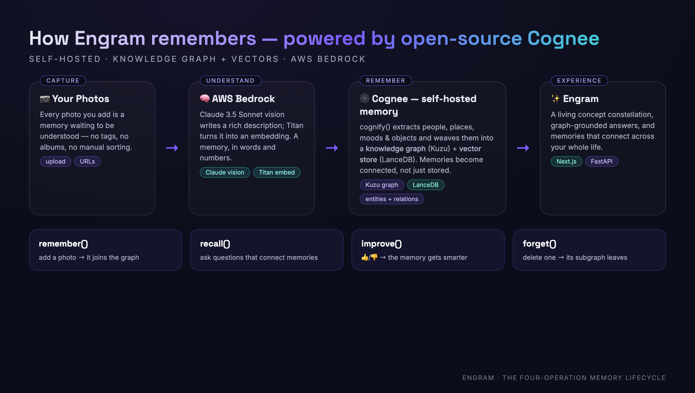

<div align="center">

# ✦ Engram

### Your photos, given a memory.

**A self-hosted "second brain" for your life's photos — built on open-source [Cognee](https://github.com/topoteretes/cognee).**

*Add a photo → it's understood, woven into a living knowledge graph, and connected to every related moment you've ever captured. Then ask your memories anything.*

`Self-hosted Cognee` · `AWS Bedrock` · `Knowledge Graph + Vectors` · `Next.js + FastAPI`

</div>



---

## Why Engram


Your camera roll is the most detailed diary you'll ever keep — and the one you never read. Engram turns that pile of flat, unsearchable images into a **connected memory you can reason with**: it understands what's in each photo, links people / places / moods / moments into a knowledge graph, and lets you *ask*, *explore*, and even *teach* it.

**Who it's for.** Engram is built around its most meaningful use: a private **reminiscence companion** — for an aging parent, someone whose memory is fading, or a family preserving a life story. It doesn't just show photos; it gently leads a person from one memory to a *connected* one they'd forgotten, read aloud, hands-free. Reminiscence is a clinically-grounded practice for memory care, and the most personal data of all should never leave the home — which is exactly why **self-hosted, open-source Cognee** is the heart of this project, not a footnote.

Most "AI memory" is a vector database doing nearest-neighbour search. Engram is different because **Cognee** gives it a real **knowledge graph alongside vectors** — vectors find what's *similar*, the graph understands what's *connected*. And it's **100% self-hosted**: your memories never leave your machine.

## Cognee's four-operation memory lifecycle — all live

| Op | In Engram | How |
|----|-----------|-----|
| **`remember()`** | Upload a photo → it joins the graph | `cognee.add(...)` + `cognee.cognify(...)` (background) |
| **`recall()`** | Ask questions that connect memories | `cognee.search(GRAPH_COMPLETION)`, answer + the exact photos used |
| **`improve()`** | 👍/👎 an answer → the memory gets smarter | `cognee.session.add_feedback()` + `cognee.improve(session_ids=…)` |
| **`forget()`** | Delete a memory → its subgraph leaves | `cognee.forget(...)` |

## Features

- ❤️ **Reminiscence Companion** *(the heart of Engram)* — a calm, voice-led, hands-free session that **walks the knowledge graph**: it starts at one memory and follows the connections (a shared person, place or feeling) to lead someone gently to a related memory they'd forgotten. Built for memory care. (`/reminisce`)
- ✨ **Forgotten Connection** — graph serendipity: two memories that quietly rhyme through shared concepts, surfaced because only a graph could notice.
- 🕸️ **Living knowledge graph** — every photo's people, places, moods and objects, extracted by Cognee and visualised interactively (`/graph`).
- ✦ **Concept Constellation** — a physics-driven map of the concepts in your life; click a concept and its memories light up.
- 🔗 **Memory Connections** — for any photo, traverse the graph to surface other memories that share concepts.
- 💬 **Ask your memories** — graph-grounded Q&A with multiple reasoning modes (graph / chain-of-thought / summary) and a **self-improving feedback loop**.
- 🌃 **City Lights** — an ambient animated view of the places your memories wandered.
- 🎙️ Human-voice narration (ElevenLabs, Polly fallback).

## Architecture

```
Photos ─▶ AWS Bedrock (Claude vision + Titan embeddings)
       ─▶ Cognee  ── cognify ──▶ Knowledge Graph (Kuzu)  +  Vectors (LanceDB)
       ─▶ FastAPI  ── remember / recall / improve / forget / graph / concepts / connections
       ─▶ Next.js  ── the Engram experience
```

- **Memory:** self-hosted Cognee — Kuzu (graph) + LanceDB (vectors) + SQLite. No cloud memory service.
- **LLM + embeddings:** AWS Bedrock (Claude 3.5 Sonnet + Titan) via Cognee's LiteLLM layer — runs on existing credits, no per-call SaaS bill.
- **Photo metadata:** SQLite (canonical record for the UI); Cognee holds the semantic memory + graph.

## Run it locally

Cognee runs self-hosted from source. Point `COGNEE_SRC` at a clone of [topoteretes/cognee](https://github.com/topoteretes/cognee).

```bash
# Backend (FastAPI + self-hosted Cognee)  →  http://localhost:8000
cd api
./run.sh                     # PYTHONPATH=$COGNEE_SRC uvicorn app.main:app --port 8000

# (optional) seed sample memories through the API
python -m app.seed

# Frontend (Next.js 14)  →  http://localhost:3000
cd ../frontend
npm install
NEXT_PUBLIC_API_URL=http://localhost:8000 npm run dev
```

**Config** lives in `api/app/main.py:configure_cognee()` (brain paths + Bedrock providers, applied via Cognee's programmatic API) and `api/.env` (see comments). AWS credentials come from your `~/.aws` profile.

## The build story

I wrote up the experience — what Cognee is, how it helped, and the gotchas — in [`blog/`](blog/).

---

<div align="center">
<sub>Built for the WeMakeDevs × Cognee hackathon · Best Use of Open Source · Engram runs entirely on self-hosted, open-source Cognee.</sub>
</div>
