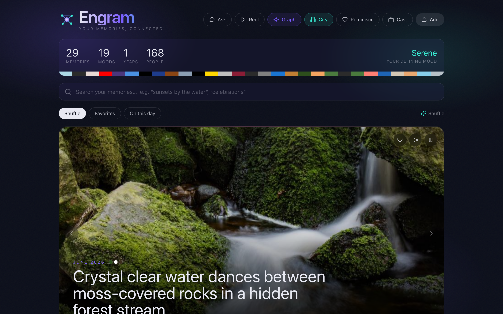
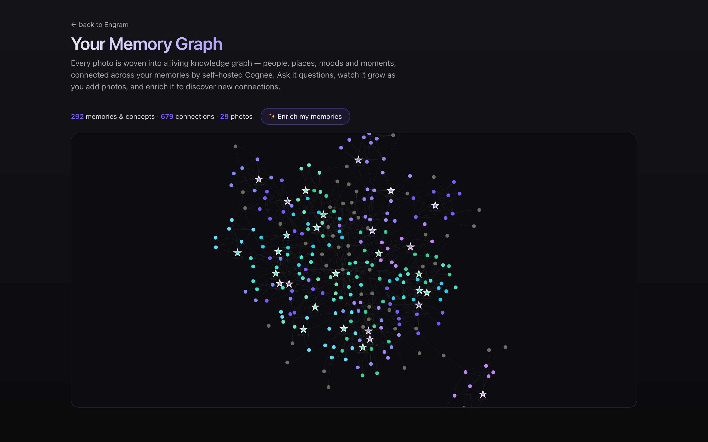
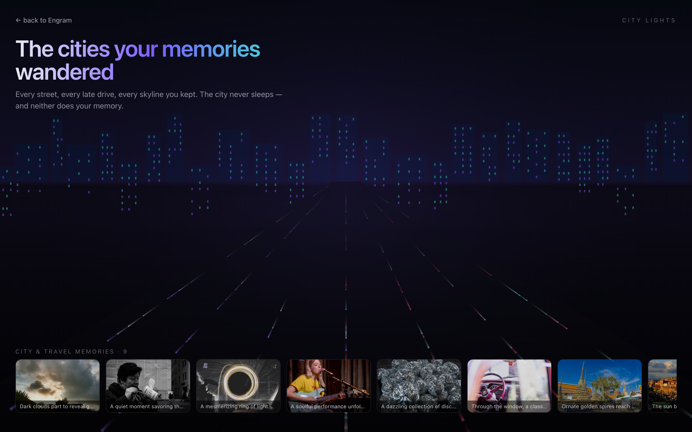

# We gave our photos a memory

*Building Engram on open-source Cognee — and why a knowledge-graph memory layer changed how we think about “AI that remembers.”*

> A build story · self-hosted Cognee · AWS Bedrock · Next.js + FastAPI

Your camera roll is the most detailed diary you’ll ever keep — and the one you never actually read. Thousands of moments, flat and unsearchable, scrolling past faster than you can remember them. We wanted to fix that. Not with another gallery app, but by giving a pile of photos something they’ve never had: **a memory that understands and connects them.**

The result is **Engram** — a self-hosted “second brain” for your life’s photos. You add a photo; it’s understood, woven into a living knowledge graph, and instantly connected to every related moment you’ve ever captured. You can *ask* your memories questions, watch a constellation of the concepts in your life, and even teach it to get smarter. The engine that made all of this possible — the part we’d happily build on again — is [open-source Cognee](https://github.com/topoteretes/cognee).



## What exactly is Cognee?

Most “AI memory” today is a vector database with good PR: embed some text, do a nearest-neighbour search, stuff the results into a prompt. It’s fine for finding similar snippets — and hopeless at *reasoning across* them.

**Cognee is an open-source memory layer that builds a real knowledge graph from your data — and pairs it with vectors.** Instead of just storing embeddings, it extracts the *entities* in your content (people, places, moods, objects, events) and the *relationships* between them, then keeps both a graph and a vector index in sync. That hybrid is the whole point: vectors find what’s *similar*; the graph understands what’s *connected*.

Crucially for us, it’s **fully self-hostable**. No managed service, no data leaving the machine — a local graph database (Kuzu), a local vector store (LanceDB), and SQLite, all spun up for you. That’s exactly what the “Best Use of Open Source” brief asked for, and exactly what you want for something as personal as your memories.

> **The four-operation memory lifecycle.** Cognee frames memory as four verbs, and we wired each to something you can see:
> - `remember()` — add a photo → it joins the graph
> - `recall()` — ask a question that connects memories
> - `improve()` — rate an answer → the memory gets smarter
> - `forget()` — delete a memory → its subgraph leaves the graph


## How Cognee actually helped us

Here’s the honest version: the hard part of a memory app isn’t the UI — it’s turning unstructured stuff into something you can reason over. Cognee deleted that entire problem.

### 1. One call turns a photo into structured memory
We caption each photo with Amazon Bedrock (Claude vision), then hand the description to Cognee. A single `cognify()` pass extracts the people, places, moods and objects and links them into the graph. We wrote zero entity-extraction code, zero relationship logic, zero graph plumbing. Twenty-eight photos became a **292-node, 679-edge** graph of a life.

### 2. Recall that reasons across memories
This is where the graph earns its keep. Ask *“which memories show the ocean at sunset?”* and Cognee doesn’t just return similar images — it traverses the graph, connects the relevant moments, and answers in plain language with the exact photos it used. Vector-only search simply can’t make those cross-memory jumps.



### 3. Entity extraction we turned into a feature
Because Cognee surfaces the concepts inside your photos, we could build a **Concept Constellation** — a physics-driven map of your mind where the biggest stars are the themes you live most. Click `sunset` and every sunset memory lights up. That feature didn’t require an ML pipeline; it’s just reading Cognee’s graph.

### 4. Memory that improves with feedback
The feature we’re proudest of: a 👍 / 👎 on every answer. The rating flows into Cognee via its session feedback API, and `improve()` folds it back into the graph weights so future recall is better. Most teams never touch this — it’s the difference between a memory that stores and a memory that *learns*.

## Under the hood: the whole memory, in a dozen lines

The most striking part is how little code it takes. Here’s the core of Engram’s memory — the four operations, exactly as we call them:

```python
# remember(): a photo's description becomes a connected memory in the graph
await cognee.add(memory_text, dataset_name="engram", node_set=[f"photo:{photo.id}"])
await cognee.cognify(datasets=["engram"])    # entities + relations → graph

# recall(): reason across memories, grounded in the graph — not just similar images
results = await cognee.search(
    query_text="which memories show the ocean at sunset?",
    query_type=SearchType.GRAPH_COMPLETION,
    session_id="engram_main", feedback_influence=0.6,
)

# improve(): your 👍/👎 folds back into the graph so recall gets better
await cognee.session.add_feedback(session_id, qa_id, feedback_score=5)
await cognee.improve(dataset="engram", session_ids=[session_id])

# forget(): remove a memory and its subgraph leaves the graph
await cognee.forget(dataset="engram", data_id=photo.cognee_data_id)
```

That’s the whole lifecycle. No embedding pipeline, no graph schema, no relationship-extraction code — Cognee owns the hard parts, so we got to spend our time on the *experience* instead of the plumbing.

## More than a photo app

We built Engram around photos, but the idea reaches much further. A memory that *understands and connects* is exactly what we lose to time and illness. The same graph that answers *“which trips had the ocean and old friends?”* could help someone with fading memory walk back through their own life story — or let a family preserve a loved one’s history as something you can actually **ask**, not just scroll past. And self-hosting matters most precisely here: the most personal data of all should never have to leave your machine. That’s the horizon this points at, and Cognee’s open-source, on-device memory is what makes it reachable.

## The real-world gotchas (and why they’re worth it)

No honest build log skips the rough edges:

- **Configuration precedence.** Cognee’s settings can prefer a discovered `.env` over process env vars. Once we configured it through Cognee’s programmatic API instead, everything became deterministic.
- **Provider wiring.** We ran Cognee’s reasoning on AWS Bedrock (Claude) and embeddings on Bedrock Titan — both via Cognee’s LiteLLM layer. The model-id prefix and region needed care, but once set it ran for free on credits we already had: **no per-call SaaS bill.**
- **Self-hosted means single-writer.** The local graph store is single-writer, so we serialised graph writes. A small price for a database that needs zero setup and never phones home.

Every one of these was a config detail, not a wall. We never once had to fight the *core idea* — the graph, the extraction, the recall all just worked.



## Why you should use Cognee

If you’re building anything that needs to *remember* — an agent, a copilot, a personal app — here’s the case in one breath: **Cognee gives you a hybrid graph-plus-vector memory, self-hosted and open-source, with a clean four-verb API, in an afternoon.**

- **It reasons, not just retrieves.** The knowledge graph answers “how are these connected?”, which is what real memory is.
- **It’s yours.** Self-hosted on local databases — your data never leaves, no vendor lock-in, no usage meter.
- **It’s model-agnostic.** OpenAI, Bedrock, Ollama, local embeddings — swap providers with a line of config.
- **It’s genuinely complete.** Add, cognify, search, improve, forget, visualise — the whole memory lifecycle is there.

We came to Cognee to win a hackathon. We’re staying because it’s the first memory layer that treats a memory like a memory — something connected, something that grows, something you can ask. Engram is just a photo frame on top of it. Point Cognee at your notes, your chats, your codebase, and you’ll see the same thing we did: the moment your data becomes a graph, it starts to feel like it *understands*.

---

*Engram is built entirely on self-hosted open-source Cognee (Kuzu + LanceDB), AWS Bedrock (Claude vision + Titan embeddings), Next.js and FastAPI. Cognee: [github.com/topoteretes/cognee](https://github.com/topoteretes/cognee).*

`#Cognee #KnowledgeGraph #AIMemory #OpenSource #AWSBedrock #SelfHosted #WeMakeDevs`
